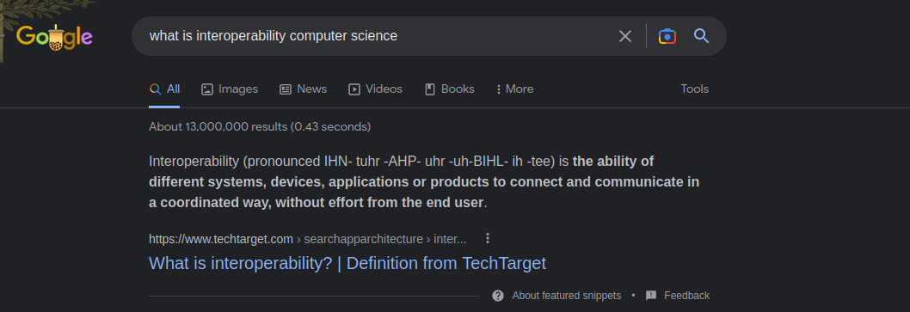

# Cyllene

A library/program for getting paraphrased answers from google. 

Useful for a batch of defintions. 

## Usage 

Insert set of words/queries separated by a newline in the words.csv file. 

## About

Works by  connecting with google search api (rapidAPI) and paraphrasing tool. Account are neeed for each. Just use temp email. 

Grabs from answerbox displayed in google search. 

    Author: Christopher Perez